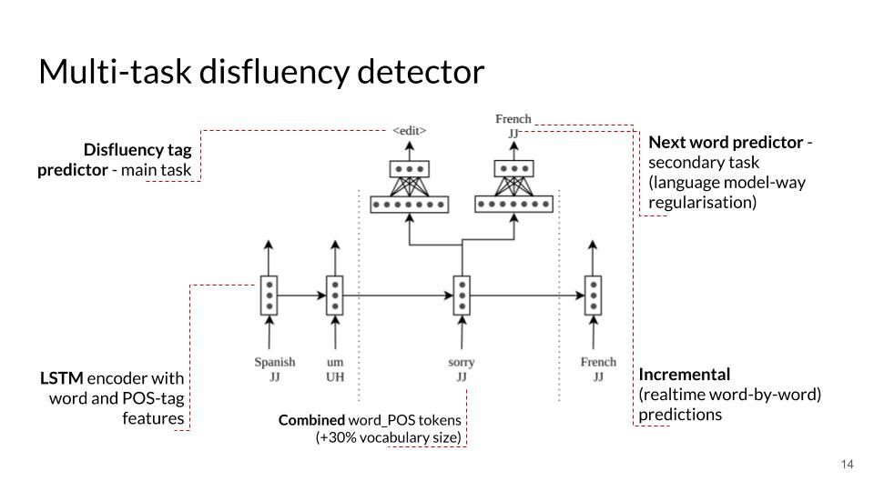

# Multitask disfluency detection
Code for the paper "Multi-Task Learning for Domain-General Spoken Disfluency Detection in Dialogue Systems" ([Igor Shalyminov](https://github.com/ishalyminov), [Arash Eshghi](https://github.com/araesh), and [Oliver Lemon](https://github.com/olemon1)) [[SemDial 2018 paper]](https://arxiv.org/pdf/1810.03352.pdf) [[Slides]](https://drive.google.com/open?id=1f3HUrKqr6JtLbem3NeDpyABmYIRfy7TM)

Model architecture
==


Getting started
==

1. Set up the environment (below are steps for Conda):

```bash
$ cd code-directory
$ git submodule update --init
$ conda create -n multitask_disfluency python=2.7
$ conda activate multitask_disfluency
$ pip install -r requirements.txt
```

2. Preprocess the Switchboard dataset for training:

```bash
$ python make_deep_disfluency_dataset.py swbd disfluency
```

3. Train the model:

```bash
$ python train.py swbd model
```

bAbI+ disfluency study data generation
==
1. Get the [bAbI tools](https://github.com/ishalyminov/babi_tools) and install requirements
2. Download [bAbI dialog tasks](https://research.fb.com/downloads/babi/) into the `babi_tools` folder
2. Run `sh make_generalization_study_datasets.sh <RESULT_FOLDER>`
3. Run `sh tag_dataset.sh <RESULT_FOLDER> <config_file_name>` for every config in `2018_generalization_study_configs`
4. The resulting datasets are `<RESULT_FOLDER>/<BABI_DATASET_NAME>/*.tagged.json`
